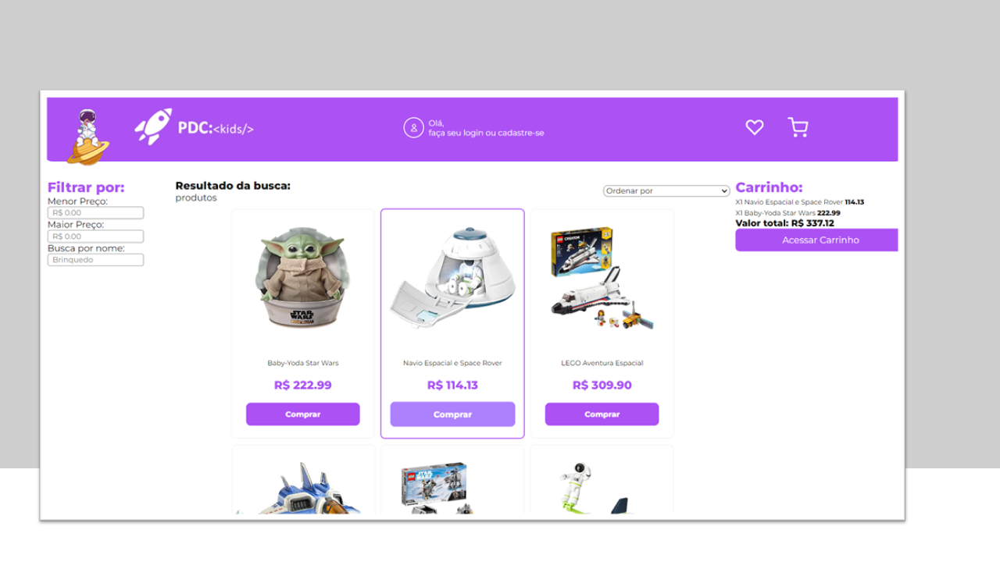

# PDC:Kids

## 📄 Introdução

Este projeto foi desenvolvido em React. O objetivo é implementar a interface de um e-Commerce de brinquedos espaciais.

Nesse projeto, você terá a oportunidade de trabalhar com toda a estrutura que compõe o React, como: JSX, Componentes, Props, Estado, Fluxo de dados no React, Renderização de listas, Renderização condicional e localStorage. 

[Clique aqui para acessar o projeto](https://projeto-frontendreact-beta.vercel.app/)

## 📄 Descrição
1. Página Inicial
    - A pagina exibirá uma lista de todos os produtos disponiveis no e-commerce, com os dados do produto (imagem, nome, preço) que poderão ser adicionados no carrinho pelo botão de "Compra". Podendo ser ordenado pela ordem do Preço Maior para o Menor e vice-versa.
    - O menu lateral esquerdo permite realizar o filtro de produtos pelo valor máximo, valor minimo e nome.
    - O menu lateral direito permite visualizar os itens que foram adicionados ao carrinho de compra (quantidade e valor total). Ao clicar duas vezes sobre o item, você conseguirá remover o item do carrinho. Ao clicar em "Acessar Carrinho", você terá acesso a próxima etapa do processo de compras.
        - Quando a página é atualizada, os itens do carrinho não serão removidos e permanecerão.

2. Página de Pedidos
    - A página exibirá uma lista de produtos adicionados no carrinho na área central, com quantidade total. 
        - Você conseguirá adicionar ou diminuir a quantidade de itens que deseja comprar. Caso o produto chegue a quantidade 0, ele será automaticamente removido do carrinho.
        - Você tem a disposição o cupom de desconto de R$ 200,00 válido para compras acima de R$ 400,00. Basta digitar o código @DEVLOVERS
        - Você pode selecionar a forma de pagamento.
    - O menu lateral direito exibirá um resumo do valor total do pedido. Para compras abaixo de R$ 200,00, o cliente terá um valor acrescido de frete de entrega no valor de R$ 50,00. Ao clicar em continuar, o pedido é finalizado e o carrinho "zerado".

## ⚒️ Tecnologias 

## 📫 Contato

E-mail: emidio.daniel@hotmail.com

